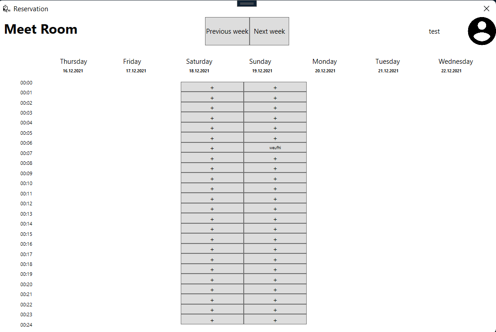

### Курсовая работа по предмету "Алгоритмы и структуры данных".
#### Выполнил: студент группы ИСТбд-22 Юдин Владимир

##### Общее задание:
Необходимо разработать систему для бронирования переговорок, которая должна представлять из себя таблицу, где в качестве колонок числа и дни недели, а в качестве строк почасовой список (формат 00:00-00:24)

### Особенности варианта:
	1. Хранить данные пользователя,карточек событий и другие данные в Java HashMap(В С# - Dictionary). Списки должны создаваться и заполняться тестовыми данными при старте приложения.
	2. Фон страниц должен быть белого цвета (background)
	3. Детали события карточки отображаются на отдельной странице
	4. Добавить невозможность добавлять карточки в будние дни (с понедельника - по пятницу), см. скриншот

Запуск осуществляется из среды разработки Visual Studio. Версия .NET 5.0, C# 9.0